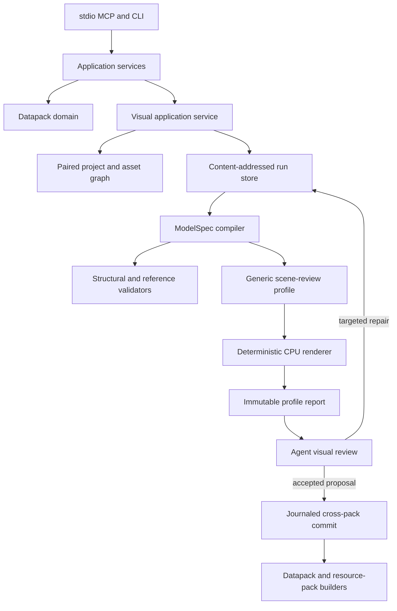

# Architecture

Packwright keeps protocol concerns separate from pack rules and side effects. Existing `datapack_*` contracts remain stable while the visual application service coordinates paired datapack/resource-pack projects through the same confined workspace.

## Request flow



The MCP layer validates request and response shapes, supplies annotations, exposes resources/prompts, and converts expected domain failures into structured tool errors. It does not implement path policy or write files directly.

The application service coordinates operations and the configured workspace's read-only boundary. Domain modules own Minecraft identifiers, resource-directory mappings, metadata, visual capabilities, diagnostics, and normalized result types. Side-effect adapters own filesystem confinement, optional external LSP communication, explicit downloads, Java processes, image decoding, rendering, transactions, and archive creation.

## Version profiles

Version-dependent behavior is represented by a composed `VersionProfile`:

```ts
interface VersionProfile {
  minecraftVersion: string;
  dataPack: DataPackProfile;
  resourcePack: ResourcePackProfile;
  visualCapabilities: VisualCapabilityProfile;
}
```

Compatibility aliases preserve the existing datapack APIs. The 26.2 server profile declares:

- Datapack format `107.1`.
- Required Java major `25` for vanilla validation.
- Singular resource-directory mappings.
- Supported registries and resource types.
- Experimental feature flags.

The 26.2 client profile declares:

- Resource-pack format `88.0`.
- Item-definition, item-model, block-model, blockstate, equipment, atlas, texture, font, and particle resource mappings.
- Model element bounds, rotations, UV units, tint rules, texture variables, parents, and display contexts.
- Item model types such as `model`, `composite`, `condition`, `select`, and `range_dispatch`.
- Allow-listed built-in parent identifiers, special-model render support levels, and declarative binding strategies. These identifiers can avoid rejecting standard parents, but v0.3 does not resolve their model or texture content; the optional client cache is readiness data, not a built-in asset resolver.
- The 26.2 removal of bed, standing-sign, and hanging-sign special models in favor of block models.
- The official client metadata entry used only by explicitly selected `setup-version --client-assets` setup.

Public tools select a supported version but do not expose internal directory rules. A future profile can therefore map the same logical identity differently without changing tool names or general result shapes. This release intentionally rejects every version other than 26.2.

`visualCapabilities` describes Minecraft's representation boundary separately from implementation readiness. `native`, `simulated`, `replacement`, and `requires_mod` are semantic claims, not marketing labels; `support` describes that vanilla boundary, while `compilerSupport` describes the current Packwright implementation. In v0.3, `compilerSupport` is `full` for `custom_item`, `limited` for `conditional_item_state`, and `unsupported` for every other target. In particular, a carrier or display rig never becomes a native new block/entity identity.

## Paired projects and asset graph

A strict manifest in `.packwright/projects/<id>.json` associates sibling datapack and resource-pack roots without moving either pack. The project adapter validates both `pack.mcmeta` files against their respective 26.2 formats before declaring the pair ready.

The custom-item graph begins at a logical identity and follows the selected vanilla carrier through the `minecraft:item_model` component to a client item definition, item model, parent, and textures. Graph nodes and edges are version-independent logical structures; binding strategies own version-specific component values and file locations. Validation rejects missing endpoints, cycles, duplicate paths, unreachable generated assets, conflicting bindings, and incomplete component-to-model chains.

## Semantic compilation and run store

The visual service accepts a strict `ModelSpec`, not arbitrary generated model JSON. Named parts, materials, parent relationships, UV intent, item states, and display transforms compile into canonical Minecraft 26.2 JSON. Review-profile selection and semantic held-item anchors remain Packwright metadata; they select review scenes and measurements but never alter compiled Minecraft files. Output ordering and serialization are deterministic.

Creative input is provider-neutral and currently agent-driven. Packwright records the supplied provider/model, prompt or request, seed, reference hashes, and derived artifact hashes; it does not require an OpenAI key or invoke a remote generator.

Every draft run is content-addressed below `<cache>/visual-runs/`. Initial request, model specification, and provenance are canonical immutable inputs. Repairs create content-addressed child revisions and can change only named parts, materials, display transforms, or constrained held-item review metadata. Textures, compiled proposals, renders, profile reports, and targeted repair records are immutable artifacts. A profile report binds the spec and compiled-artifact hashes, renderer/profile versions, resolved scene-plan hash, required view IDs and image hashes, measurements, and readiness result. A separate bounded state index identifies exactly one active workflow head for each paired project, not one per asset or run; omitted IDs select it and `project_build` always uses it. v0.3 does not aggregate multiple active item heads. Custom external textures and state models are resolved only from their normal paths in the paired sibling resource pack, not dependency packs, Mojang asset objects, another filesystem location, or the client-assets cache.

## Review profiles and deterministic rendering

Review profiles are Packwright policy layered between the canonical compiler output and the rasterizer. A profile defines required and semantic-conditional scenes, Packwright-authored reference geometry, cameras, reusable measurement rules, and fixed warning/failure thresholds. Profile versions change independently from Minecraft pack formats, while a renderer-version change invalidates old evidence. The same interface can later support block, placeable, armor, projectile, GUI-item, and entity-model scenes without putting target-specific branches into the rasterizer.

The first implementation is `held_item@1`. It resolves 12 required Steve/Alex first-person, wide-FOV, third-person, and neutral scenes, then adds swing, active-use, two-handed, or aiming scenes when the semantic metadata calls for them. The complete plan remains bounded to 16 scenes. Minecraft first/third-person display transforms apply only to the compiled item; independently posed reference arms and bodies are review evidence and are never compiled into the resource pack.

The `packwright-cpu-v2` profile renderer is a bounded software rasterizer for the current cuboid/plane item model subset. It tessellates only compiled faces, applies fixed scene transforms and cameras, z-buffers, alpha-blends, samples textures with nearest-neighbor filtering, and derives asset/reference bounds without Chromium, Blender, OpenGL, or a running game. `held_item@1` reduces that evidence into advisory primary/secondary grip reach, approximate transformed arm/torso intersection, alpha-weighted screen coverage, forward-axis alignment, mirrored grip-and-orientation delta, and projected-area frame retention. A bounded contact sheet is returned with the tool result; individual PNGs and the immutable report remain addressable as MCP resources.

The report and images are deterministic review surfaces, not authoritative evidence of actual client rendering. Transformed axis-aligned bounding-box overlap is not exact mesh collision, cameras and FOVs are representative, and active-use scenes currently pose the base compiled geometry rather than resolving every conditional item model. Unsupported special models and exact client behavior require a future real-client capture adapter.

## Filesystem transactions

All pack paths begin at the canonical workspace. The confinement adapter normalizes input, rejects absolute/traversal paths, checks real ancestors and symlinks, and verifies the final target remains beneath both workspace and pack root.

Single-file mutations are serialized by target path. A write is prepared in the target directory and committed using atomic rename, after checking any required expected SHA-256. Build scanning shares the same confinement and capacity limits.

An accepted visual binding spans both packs, so `visual_commit` uses a multi-file transaction. It resolves every path, acquires locks in sorted order, verifies all proposal content and destination preconditions, stages output beside each destination, and writes a journal below `.packwright/transactions/` before installation. The same transaction installs a canonical workspace receipt that binds the workspace identity, proposal, manifest, and exact output hashes. This makes a retry idempotent if the cache index could not be updated after installation. A failed install triggers guarded rollback; an unrecoverable rollback retains its journal and returns `transaction_recovery_required`. Transactions are bounded to 512 files and 64 MiB.

The visual run store is not the project commit boundary. Draft compilation and rendering can update private cache artifacts while a workspace is opened read-only; `visual_project_attach`, `visual_commit`, and `project_build` cannot mutate the workspace in that mode.

## Validation authority

Packwright-owned structural rules always run. An external Spyglass executable can be configured by the operator for complementary LSP diagnostics, but is not a dependency or source of authority. By default, validation then compiles every logical `.mcfunction` command with the pinned Minecraft 26.2 runtime's real command dispatcher, pack-aware registries, and component codecs. Vanilla parse failures are authoritative; Packwright-generated identifier suggestions remain heuristics over the verified cached reports.

The command-validation adapter receives the same stable scan snapshot used by structural validation. It stages the pack, replaces original function bodies with inert placeholders, and creates one unreferenced synthetic function for each logical command. A random-namespace always-pass harness causes vanilla to load and compile every probe independently without executing a user function. This preserves source-line mapping and allows failures after an invalid earlier line to be reported. The adapter launches a fixed Java 25 entrypoint with controlled arguments, bounds and parses the official logs, honors cancellation/timeout, verifies that the source snapshot did not change, and cleans all disposable state. It never receives a user world path.

This layer establishes dispatcher and codec validity, not runtime behavior. Macro templates can be checked, but their substituted command is deferred until arguments exist. Objective/entity/storage existence, conditional outcomes, scheduling, and side effects still require focused GameTests or review. Vanilla pack loading and GameTest execution therefore remain the highest-confidence behavior evidence and explicit local operations.

Operators can disable the vanilla command adapter only for a `validate` request, preserving an offline structural-analysis path. Public build operations always include it and fail closed when Java 25, the verified cache, the harness result, or a command is invalid.

For an uncommitted visual proposal, validation applies the exact proposal files to stable snapshots of the associated packs. Resource-pack checks receive the full sibling resource-pack snapshot plus its overlay; command validation and optional GameTests receive the full datapack snapshot plus its overlay. The proposal is therefore validated in its surrounding project rather than as isolated generated files.

Visual profile measurements use `advisory` authority. Packwright nevertheless fails render readiness when a configured `held_item@1` threshold fails, and `visual_commit` verifies that the exact current spec, compiled proposal, profile plan, renderer/profile versions, report, and required view hashes still agree. Missing optional semantic metadata produces explicit skipped findings so older specifications remain usable without claiming those checks passed. This is a workflow quality gate, not a claim of authoritative Minecraft-client rendering.

## Packaging

The build adapter refuses packs with structural or authoritative vanilla command errors, sorts archive entries, fixes ZIP metadata that would otherwise vary, and places `pack.mcmeta` at the archive root. Build has no vanilla-validation bypass. The returned size and SHA-256 let callers verify and compare artifacts.

`project_build` accepts no run/revision selector and requires the project's active workflow head to have ready textures and compiled artifacts and to be rendered, bound, and committed. It validates exact stable snapshots of both committed packs rather than a draft overlay, verifies that the source scans remain unchanged, creates two deterministic ZIPs, and installs both outputs through one journaled transaction so a failure cannot leave a newly built datapack without its matching resource pack. Its `truncated` result flag records whether bounded diagnostics were shortened. The artifacts remain independent so a Minecraft client can enable the resource pack separately from the server/world datapack.
